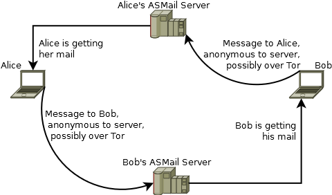
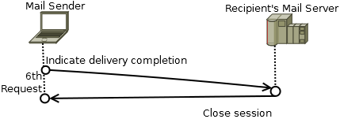
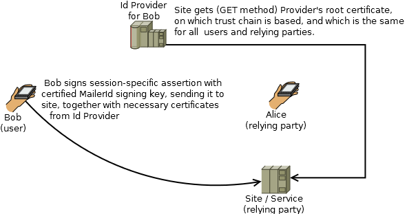

### Archive note

3NWeb has matured. Documentation can be found at [IEEE Open Source section](https://opensource.ieee.org/3nweb/architecture), pointing to reference implementation.

# 3NWeb protocols and demo implementation

**3NWeb** is a set of protocols that sincerely implement [Principle of Least Authority (POLA)](https://en.wikipedia.org/wiki/Principle_of_least_privilege) in services with client+server architecture.
For such architectures POLA is articulated into the following prescriptive form:
 - with <b>No plain text</b> on a server
 - with <b>No unnecessary metadata</b> on a server
 - there is <b>Nothing to steal</b> from the server

Four protocols are defined and implemented (as in nice demo).

ASMail protocol is for mail and, more generally, for asynchronous messaging.  
Among other things, ASMail protocol features anonymity of sender to server with simultaneous strong authentication to recipient.

3NStorage protocol is for remote storage and file sharing, private (anonymous) and secure.

MailerId protocol provides non-tracking identity service.
It is directly used by ASMail and 3NStorage protocols.
And MailerId can also be used by other services/sites in place of identity trackable protocols, like [OpenID](https://en.wikipedia.org/wiki/OpenID).

Public Key Login (PKL) protocol provides authentication based on public keys.
This protocol, in particular, is used in MailerId for a sensitive provisioning phase.
And PKL can be used everywhere instead of passwords, as MitM on password-carrying HTTPS channel immediately discloses password to an attacker, while with PKL such attack turns into an offline attack on password, if key is derived from a password.  
PKL can be setup with secondary authentication factor(s) in addition to a key, whether it is derived from a password, or not.

All protocols are formulated to use high-level cryptographic functionality.
And are using [NaCl](http://nacl.cr.yp.to/) library, that provides such high-level functionality.

## Demo implementation of protocol specs

Demo services are express apps on node.
Client side apps are served on a web page only for demonstration convenience, while production code should sit in a local app, to mitigate threat of js-injection.

All of code is written in TypeScript, with source in ``` src ``` folder.
[Gulp](http://gulpjs.com/) is used to compile everything.
Folder ``` dist ``` contains executable js.
To run directly from download, do
```
npm install
node dist/app.js
```
Or you may want to look into gulp's tasks, after dependencies' installation.
Make sure to have gulp installed globally, and follow instructions printed by
```
gulp help
```


## Authenticated Secure Mail (ASMail)

 

In ASMail sender talks directly to recipient's server:  
 1. When sender (e.g. bob@bank.com) needs to send a message to alice@company.com, his client software gets from company.com's DNS record a location of ASMail service that services all users at a said domain.  
This is a service discovery part, and we use existing naming infrastructure for this discovery purpose.
 2. Sender is talking to recipient's server via HTTPS. Delivery protocol is a set of requests that happen within one session.  
Such setup allows service provider to transparently implement any appropriate existing load balancing techniques on its web servers.

### Message delivery to recipient's server


The very first sender's request establishes a session, with which a message transmition occurs. Sender sends to server:  
 - recipient's address, so that server knows to who message is for;
 - optional, sender's address, when sender is willing to prove his identity to server (authorization by server);
 - optional, invitation token, mostly used in transmitions, when sender is not providing his identity to server;

Server starts a session, if given parameters are acceptable, and fails when:  
 - recipient is not known;
 - recipient wants server to always authenticate sender's identity, when there is no invitation token given;
 - invitation token is invalid;
 - recipient's mail box is full.

In OK reply, server sends an allowed maximum size, and a maximum chunk size, which is used to split big objects into separate requests.  
Note that a recipient may configure her server to allow different message sizes: GB's for a trusted group (particular invitation token), and KB's for strangers.


Sender's software may perform a pre-flight request, which is the same as the first request except that no session is started.

Pre-flight request is useful in a situation, when message limits must be known before a message is formed, e.g. audio or video mail.


Server may allow a delivery-restarting for an already expired session.

This first request is identical to that of sending a new message, except that sender must provide an id of a message, which transmition has not been properly finalized.


When delivery is not anonymous to server, sender should prove its identity to the server. For this an identity providing protocol is needed.

Identity protocols like OpenID do not follow POLA, because they unnecessarily leak to identity provider information about which identity is used, how often it is used, etc., allowing for an adversarial tracking.

BrowserID is a non-tracking identity protocol, developed by Mozilla for use in a browser. We took BrowserID's core concepts, removed browser-specific elements, hardened it, called it MailerId, and use it here. Do see a section on MailerId below.

So, sender creates a MailerId assertion, based on a current session id. Server cryptographically checks it, and either allows further actions, or not, based on the result.


In a situation, when a sender has not yet established a key pair, known only to it and to a recipient, an introductory (initial) key should be given by recipient's server. Recipient generates such key, certifies public key with MailerId, and gives resulting certificates to its server, so that the server provides key certificates to whoever need them.

Notice two important things:  
 - ASMail protocol does not require one to use keys, provided through mail server. One may use keys acquired through other trusted channels, like physical exchange of business cards.
 - Sender must check MailerId certificates before using a key that comes through mail server.

When parties exchange messages, new keys are constantly introduced and used, allowing for PFS (Perfect Forward Secrecy). Therefore, an adjective “introductory” is used to highlight the fact that given key is not used for all messages, and that it will be used only in an initial message exchange.


This request starts message delivery. Sender gives to server a metadata part, which has to be plaintext, as it contains a list of all objects that comprise the message and crypto ids that are used by a recipient to identify keys that will decrypt the message.

Note that metadata does not contain anything else. Common headers like “Subject” are all part of the main object, and, therefore, are encrypted and available only to the recipient.


Objects are delivered in whole or in chunks by this request, which is done many times till a message is completely sent to the server.



This request closes message delivery session. With it sender assures server that it has been given all message parts.

### Message retrieval by recipient

Recipient may look up its ASMail server in DNS record for its domain, exactly how sender looks up DNS.

Recipient authenticates to server either with MailerId or Public Key Login (see sections below) and retrieves its messages with a particular set of quite simple requests.


## 3NStorage

To be written.

## MailerId

MailerId process involves three parties:  
 1. Identity provider (identity service)
 2. User of an identity service
 3. Relying party, to who user wants to prove her identity


In the first stage, User generates a signing key pair, logs into the service, and asks Identity Provider to make (provision) a certificate for his public key.

User's certificate can be used till its expiration. Therefore, provisioning step does not need to be repeated for a while (usually a few hours).

Unlike BrowserID, User's login in MailerId is done via Public Key Login (PKL) process. PKL does not require having a browser. PKL can be used for both key-only, password-based, and multi-factor authentications. See Public Key Login section below.


With a provisioned certificate for his signing key, User can sign his other public key. For example, ASMail introductory key should be signed with MailerId key.

When Alice (relying party) has to verify a key that is claimed to be for  bob@bank.com, the following steps are taken:  
 1. DNS record for bank.com is checked for a location of MailerId providing service.
 2. Provider's root certificate is retrieved from service location with a request that is the same for all relying parties. Such request does not contain neither information about the user, nor about relying party, in a spirit of POLA.
 3. Alice checks complete certificate chain.

Note that provider gives user two certificates: one for user's key, signed by provider's key, and another one is for provider's key, signed by root key. Root key certificate is self signed, and should have a long validity period. Provider keys have shorter life and are changed by provider from time to time.



With a provisioned certificate for his signing key, User can sign MailerId assertions to authenticate sessions. One example is authentication of a sender to ASMail server, when delivery is non-anonymous. Another example is authenticating a session to any web site/service.

Relying Party (site/service) generate a random session id, which is then given to User. User signs an assertion with Relying Party's domain and a given unique session id inside, and sends it back to Relying Party together with his MailerId certificates. Relying Party performs the same retrieval of MailerId root certificate and a cryptographic check of all signatures in a complete chain of certificates, and checks both session id and domain in a provided assertion.

Relying Party should produce unique session ids, while User should make assertions that are valid only for a short period of time. This shall avoid reuse of signed assertions.

Note that, although MailerId protocol is developed for use in ASMail, the protocol can be used for universal authentication on the web, eliminating a requirement of having a separate password for every single web, while preserving user's privacy.

## Public Key Login (PKL)

This protocol was inspired by a desire of having an analog of SSH key-based login, in which Site (service) has on file User's public key, and User has prove its knowledge of a corresponding secret key.

 

When an account is created with a Site, User registers its public key together with additional key derivation parameters (e.g. salt + scrypt parameters).

Key derivation parameters are needed in a setting, where User has no permanent storage for a secret key, and it has to be derived from a password. When, on another hand, User stores its secret key, derivation parameters are ignored by User. Requests in both cases are the same.

The whole Public Key Login (PKL) process consists of two steps:  
 1. In the first request, Site generates a new symmetric session key (random bytes), encrypts this key to User's public key on file, and sends the cipher as a cryptographic challenge back to User.  
Only random bytes of a session key are encrypted into the cipher. The cipher is send without authentication hash. Therefore, it is not possible to know if an incorrect key is used for opening the cipher.  
The cipher is sent together with key derivation parameters and Site's public key, which should be used to open the cipher.
 2. If needed, User, given key gereration parameters, generates its secret key.  
User decrypts bytes of a session key from a given cipher, encrypts session key with itself, and sends resulting cipher as a start of a second request.
3. Server verifies that User was able to encrypt session key with itself. And sends back cipher authentication hash, which was not sent in the first request, to prove to User that the server does have User's login public key.

## License

Specification of all protocols, formulated here, is freely available for anyone to implement and use on both server and client side.

Demo *implementation* of 3NWeb protocols, i.e. code in this repository, is covered by GPL-3.0.
